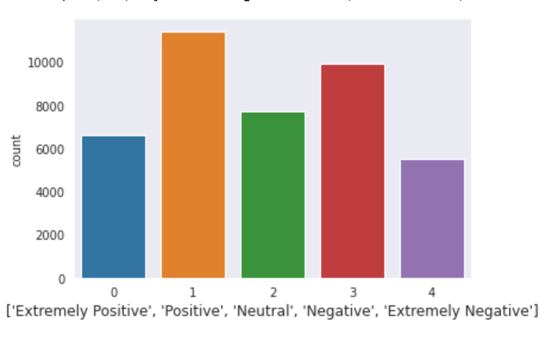
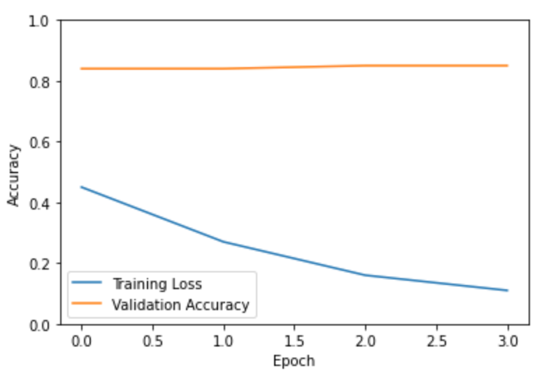

# Tweet Classification with Bert-language model

This repository contains code to implement a Sentiment Classification for Twitter tweets with the model ```Bert``` from the ```transformers``` library from huggingface. A pretrained model is used that is fine-tuned for the task with several thousand instances. 

I chose pytorch for implementing the ml-pipeline.

In the Notebooks directory there are 2 versions of the sentiment classification, I recommend using ```BertTwitterClassifier```. The content of the data evolves around the pandemic, which is where the dataset comes from (hence the name Corona-Dataset).

Five ordinal categories are rated 

The highest accuracy achieved was about 89%, quite decent, but there is room for improvement.

Doing so will be easy given the initial model yielded similar validation loss for the epochs:




The following steps are described in each notebook:

- Loading Data
- Preprocessing
- Visualization
- Model instantiation
- Training
- Novel prediction making
- Evaluation
- Saving 


To make this notebook run fast, I recommend employing a cloud service or a powerful graphics card.
